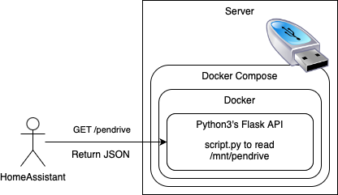

# serverPendriveMonitorToHomeAssistant
Full end to end configuration to have a docker container monitoring something, and HomeAssistant reading that information

This repo is meant to:
- Create a python3 API
- Get pendrive free space
- Use docker to avoid installing python3 or Flask
- Use docker composer for additional config
- Configure Home Assistant to read the API

